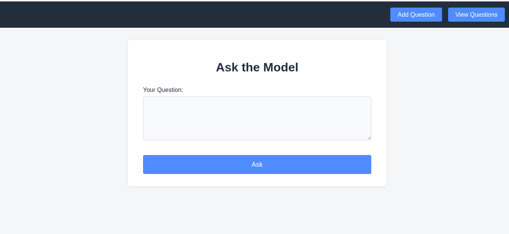
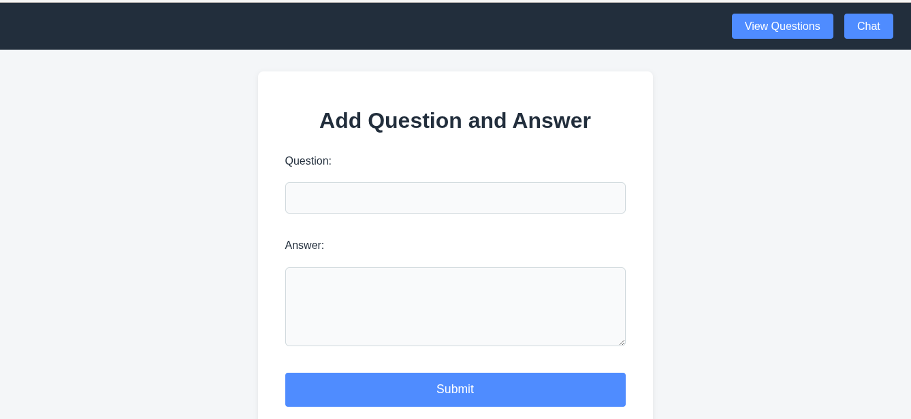
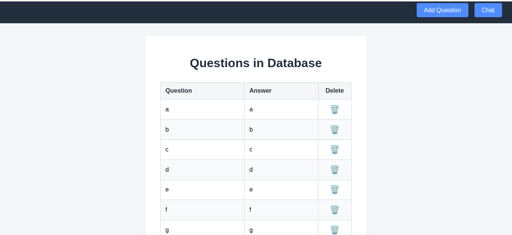

# RAG-Chroma-OpenAI

This project implements a Retrieval-Augmented Generation (RAG) system using Flask, OpenAI, and ChromaDB. It allows you to perform intelligent queries on your own data, integrating generative AI capabilities.

<div align="center">

# Hacker News Top 5 Articles







</div>

## Installation

1. Clone the repository and navigate to the project folder:

```bash
git clone https://github.com/mateolafalce/rag-chroma-openai.git
cd rag-chroma
```

2. Create and activate a virtual environment:

```bash
python3 -m venv venv
source venv/bin/activate
```

3. Install the dependencies:

```bash
pip install flask openai dotenv chromadb
```

4. Create a `.env` file in the project root with your OpenAI API key:

```env
OPENAI_API_KEY=sk-...
```

## Usage

1. Start the Flask application:

```bash
python app.py
```

2. Access the web interface at [http://localhost:5000](http://localhost:5000).

